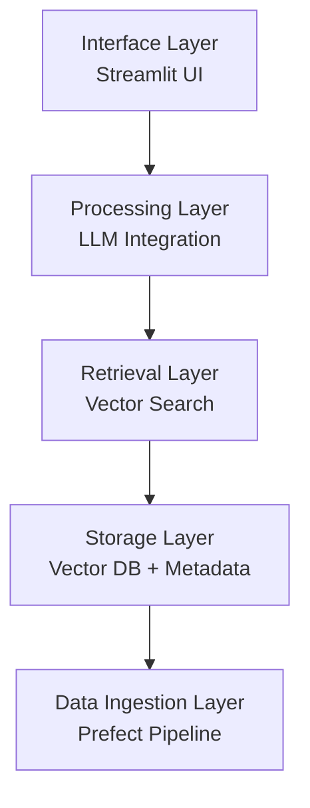

# Site Enhancement Implementation Plan
**donbr.github.io Portfolio Site Enhancement**

Based on recommendations from `Site-review-recommendations.txt`

---

## Overview
Implement content enhancements to showcase AI engineering expertise and mentorship work through automated content generation from existing GitHub repositories and structured data.

**Goals:**
- Surface AI engineering technical depth
- Highlight mentorship and teaching leadership
- Automate content updates from source repositories
- Maintain static architecture and deployment simplicity

---

## Phase 1: Quick Wins - Mentorship Section
**Priority:** P0
**Effort:** 2-3 hours
**Impact:** HIGH

### 1.1 Add Mentorship Section to HomePage
**File:** `src/pages/HomePage.tsx`

**Location:** Add new section between Projects and Contact sections (after line 184)

**Content Structure:**
```jsx
<section id="teaching" className="bg-gray-50 py-16">
  <div className="max-w-6xl mx-auto px-4">
    <h2 className="text-3xl font-bold text-gray-800 mb-8">Teaching & Mentorship</h2>

    {/* Introduction */}
    <div className="mb-8">
      <p>AI Makerspace Certified AI Engineer Bootcamp - Lead Instructor & Mentor</p>
    </div>

    {/* Sessions Taught */}
    <div className="grid md:grid-cols-3 gap-6">
      <SessionCard
        title="Synthetic Data Generation"
        session="Session 7"
        topics={["Data augmentation", "Quality evaluation", "Privacy preservation"]}
      />
      <SessionCard
        title="RAG Evaluation Metrics"
        session="Sessions 8-9"
        topics={["Retrieval accuracy", "Generation quality", "End-to-end evaluation"]}
      />
      <SessionCard
        title="Advanced Retrieval Strategies"
        session="Session 10"
        topics={["Hybrid search", "Reranking", "Contextual retrieval"]}
      />
    </div>

    {/* Impact Statement */}
    <div className="mt-8">
      <p>Guided cohort through hands-on implementation of production-grade RAG systems...</p>
      <Link to="/teaching/mentorship">Learn more about my teaching approach →</Link>
    </div>
  </div>
</section>
```

**Tasks:**
- [ ] Create SessionCard component (inline or separate)
- [ ] Add teaching section with three session cards
- [ ] Add impact statement and link to detailed mentorship page
- [ ] Style consistently with existing sections

### 1.2 Update Navigation
**File:** `src/components/layout/Layout.tsx`

**Changes:**
- Add "Teaching" link to navigation (after Projects, before Contact)
- Update navigation links array around line 63

```tsx
<a
  href="/#teaching"
  className={cn(
    "py-4 px-2 hover:text-gray-900",
    location.hash === '#teaching' ? "text-gray-900 border-b-2 border-blue-500" : "text-gray-500"
  )}
>
  Teaching
</a>
```

**Tasks:**
- [ ] Add Teaching navigation link
- [ ] Test hash-based navigation
- [ ] Verify active state highlighting

---

## Phase 2: Project Deep-Dive Pages
**Priority:** P1
**Effort:** 2-3 days
**Impact:** HIGH

### 2.1 GDELT Knowledge Base Project Page

**Route:** `/assets/projects/gdelt-knowledge-base`

**Content Source:** `aie8-cert-challenge/gdelt-knowledge-base` repository README.md

**Component:** `src/components/projects/gdelt-kb/GdeltKnowledgeBase.tsx`

**Page Structure:**
1. **Hero Section**
   - Project title: "GDELT Knowledge Base - RAG System Architecture"
   - Subtitle: Context and purpose
   - Links: GitHub repo, Dataset, Live demo

2. **Architecture Overview**
   - Five-layer architecture description
   - Architecture diagram (see Phase 4)
   - Layer details:
     - Data Ingestion Layer
     - Storage Layer (vector DB, metadata)
     - Retrieval Layer (search strategies)
     - Processing Layer (LLM integration)
     - Interface Layer (API/UI)

3. **Evaluation Results**
   - Cohere reranker performance metrics
   - Comparison table (different retrieval strategies)
   - Key findings and insights

4. **Technical Implementation**
   - Technologies used
   - Key design decisions
   - Code snippets (if available)

5. **Dataset Details**
   - GDELT Global Knowledge Graph overview
   - Data structure and schema
   - Time period coverage
   - Link to Hugging Face dataset

**Data Structure:**
Create `/src/data/project-details.json`:
```json
{
  "gdelt-knowledge-base": {
    "title": "GDELT Knowledge Base",
    "subtitle": "Production-grade RAG system for global event analysis",
    "architecture": {
      "description": "Five-layer architecture...",
      "layers": [
        {
          "name": "Data Ingestion Layer",
          "description": "...",
          "technologies": ["Prefect", "Python", "Parquet"]
        }
      ]
    },
    "evaluation": {
      "summary": "Cohere reranker achieved highest performance...",
      "metrics": [
        {
          "strategy": "Cohere Rerank",
          "precision": 0.92,
          "recall": 0.88,
          "f1": 0.90
        }
      ]
    },
    "links": {
      "github": "https://github.com/aie8-cert-challenge/gdelt-knowledge-base",
      "dataset": "https://huggingface.co/datasets/dwb2023/gdelt-gkg-march2020-v2",
      "demo": "https://huggingface.co/spaces/dwb2023/insight"
    }
  }
}
```

**Tasks:**
- [ ] Create component directory and main file
- [ ] Implement page sections following HomePage pattern
- [ ] Add route to App.tsx
- [ ] Create data structure (manual first, automation in Phase 3)
- [ ] Link from ProjectsPage existing GDELT cards

### 2.2 Advanced Retrieval Project Page

**Route:** `/assets/projects/advanced-retrieval`

**Content Source:** `don-aie-cohort8/aie8-s09-adv-retrieval` repository README.md

**Component:** `src/components/projects/advanced-retrieval/AdvancedRetrieval.tsx`

**Page Structure:**
1. **Hero Section**
   - Title: "Advanced Retrieval Strategies for RAG Systems"
   - Subtitle: "Comprehensive exploration of modern retrieval techniques"
   - Course context: AI Makerspace Session 10

2. **Retrieval Taxonomy**
   - Visual diagram of retrieval strategies (see Phase 4)
   - Strategy categories:
     - Vector Search (dense retrieval)
     - Sparse Retrieval (BM25, keyword)
     - Hybrid Search (combining approaches)
     - Contextual Retrieval
     - Re-ranking strategies

3. **Cohere Reranker Evaluation**
   - Comparative analysis
   - Performance metrics
   - Use case recommendations

4. **Implementation Examples**
   - Code snippets from teaching materials
   - Best practices learned
   - Common pitfalls

5. **Teaching Insights**
   - How this was taught in bootcamp
   - Student challenges and solutions
   - Key takeaways

**Data Structure:**
Add to `/src/data/project-details.json`:
```json
{
  "advanced-retrieval": {
    "title": "Advanced Retrieval Strategies",
    "context": "AI Makerspace Bootcamp Session 10",
    "taxonomy": {
      "categories": [
        {
          "name": "Vector Search",
          "description": "Dense retrieval using embeddings",
          "techniques": ["Cosine similarity", "Approximate nearest neighbors"],
          "pros": ["Semantic understanding", "Handles synonyms"],
          "cons": ["Computationally expensive", "Black box"]
        }
      ]
    },
    "evaluation": {
      "focus": "Cohere Rerank API",
      "results": "...",
      "comparison": []
    },
    "teachingNotes": {
      "challenges": ["Understanding trade-offs", "Implementation complexity"],
      "solutions": ["Hands-on notebooks", "Real-world examples"],
      "keyTakeaways": []
    }
  }
}
```

**Tasks:**
- [ ] Create component directory and main file
- [ ] Implement retrieval taxonomy section
- [ ] Add evaluation results display
- [ ] Include code examples with syntax highlighting
- [ ] Add teaching insights section
- [ ] Create route in App.tsx
- [ ] Add new project card to ProjectsPage

### 2.3 Update App.tsx Routes

**File:** `src/App.tsx`

**Changes:**
Add new routes (after existing project routes around line 26):
```tsx
<Route path="/assets/projects/gdelt-knowledge-base" element={<GdeltKnowledgeBase />} />
<Route path="/assets/projects/advanced-retrieval" element={<AdvancedRetrieval />} />
```

Import new components:
```tsx
import GdeltKnowledgeBase from '@/components/projects/gdelt-kb/GdeltKnowledgeBase';
import AdvancedRetrieval from '@/components/projects/advanced-retrieval/AdvancedRetrieval';
```

**Tasks:**
- [ ] Add imports
- [ ] Add routes
- [ ] Test navigation

### 2.4 Update ProjectsPage

**File:** `src/pages/ProjectsPage.tsx`

**Changes:**

1. Update existing GDELT project cards to link to new detail page:
```tsx
// Update GDELT GKG Viewer card (around line 129)
{
  title: "GDELT GKG Viewer",
  description: "...",
  tags: [...],
  demoUrl: "https://graph-viz-next.vercel.app/gdelt-records-viewer",
  detailUrl: "/assets/projects/gdelt-knowledge-base" // NEW
}
```

2. Add new Advanced Retrieval project card:
```tsx
{
  title: "Advanced Retrieval Strategies for RAG",
  description: "Comprehensive exploration of modern retrieval techniques including vector search, hybrid approaches, and re-ranking strategies. Developed and taught as part of AI Makerspace bootcamp curriculum.",
  tags: ["Python", "RAG", "Vector Search", "Cohere", "LangChain", "Education Tech"],
  detailUrl: "/assets/projects/advanced-retrieval",
  codeUrl: "https://github.com/don-aie-cohort8/aie8-s09-adv-retrieval"
}
```

3. Update ProjectCard component to handle detailUrl:
```tsx
{detailUrl && (
  <Link
    to={detailUrl}
    className="text-blue-600 hover:text-blue-800 block"
  >
    Learn More →
  </Link>
)}
```

**Tasks:**
- [ ] Add detailUrl field to project interface
- [ ] Update ProjectCard to render detail links
- [ ] Update existing GDELT cards
- [ ] Add Advanced Retrieval project card
- [ ] Test all links

---

## Phase 3: Content Generation Infrastructure
**Priority:** P2
**Effort:** 1-2 days
**Impact:** MEDIUM (enables automation)

### 3.1 Content Generation Script

**File:** `/scripts/generate-content.js`

**Purpose:** Fetch README content from GitHub repositories and generate structured JSON data for project pages.

**Dependencies:**
```json
{
  "node-fetch": "^3.3.0",
  "marked": "^11.0.0"
}
```

**Script Structure:**

```javascript
import fetch from 'node-fetch';
import { marked } from 'marked';
import fs from 'fs/promises';
import path from 'path';

// Configuration
const REPOS = [
  {
    owner: 'aie8-cert-challenge',
    repo: 'gdelt-knowledge-base',
    key: 'gdelt-knowledge-base'
  },
  {
    owner: 'don-aie-cohort8',
    repo: 'aie8-s09-adv-retrieval',
    key: 'advanced-retrieval'
  }
];

// Fetch README from GitHub
async function fetchGitHubReadme(owner, repo) {
  const url = `https://api.github.com/repos/${owner}/${repo}/readme`;
  const response = await fetch(url, {
    headers: {
      'Accept': 'application/vnd.github.v3+json',
      'User-Agent': 'donbr-portfolio-generator'
    }
  });

  if (!response.ok) {
    throw new Error(`Failed to fetch ${owner}/${repo}: ${response.statusText}`);
  }

  const data = await response.json();
  return Buffer.from(data.content, 'base64').toString('utf-8');
}

// Parse markdown sections
function parseMarkdownSections(markdown) {
  const tokens = marked.lexer(markdown);
  const sections = {};
  let currentSection = null;
  let currentContent = [];

  tokens.forEach(token => {
    if (token.type === 'heading' && token.depth === 2) {
      if (currentSection) {
        sections[currentSection] = currentContent.join('\n');
      }
      currentSection = token.text;
      currentContent = [];
    } else if (currentSection) {
      currentContent.push(token.raw);
    }
  });

  if (currentSection) {
    sections[currentSection] = currentContent.join('\n');
  }

  return sections;
}

// Main generation function
async function generateProjectDetails() {
  const projectDetails = {};

  for (const repoConfig of REPOS) {
    console.log(`Fetching ${repoConfig.owner}/${repoConfig.repo}...`);

    try {
      const readme = await fetchGitHubReadme(repoConfig.owner, repoConfig.repo);
      const sections = parseMarkdownSections(readme);

      projectDetails[repoConfig.key] = {
        readme: readme,
        sections: sections,
        lastUpdated: new Date().toISOString()
      };

      console.log(`✓ Successfully processed ${repoConfig.key}`);
    } catch (error) {
      console.error(`✗ Error processing ${repoConfig.key}:`, error.message);
    }
  }

  // Write to data file
  const outputPath = path.join(process.cwd(), 'src/data/project-details.json');
  await fs.writeFile(outputPath, JSON.stringify(projectDetails, null, 2));
  console.log(`\n✓ Generated project details at ${outputPath}`);
}

// Run
generateProjectDetails().catch(console.error);
```

**Tasks:**
- [ ] Create scripts directory
- [ ] Create generate-content.js
- [ ] Install dependencies (node-fetch, marked)
- [ ] Test script manually
- [ ] Customize extraction functions based on actual README structure
- [ ] Handle errors gracefully

### 3.2 Update Build Process

**File:** `package.json`

**Changes:**
```json
{
  "scripts": {
    "generate-content": "node scripts/generate-content.js",
    "prebuild": "npm run generate-content",
    "dev": "vite",
    "build": "vite build"
  },
  "devDependencies": {
    "node-fetch": "^3.3.0",
    "marked": "^11.0.0"
  }
}
```

**Tasks:**
- [ ] Add generate-content script
- [ ] Add prebuild hook
- [ ] Install new dependencies
- [ ] Test build process

---

## Phase 4: Architecture Diagrams
**Priority:** P2
**Effort:** 2-3 days
**Impact:** MEDIUM-HIGH (visual communication)

### 4.1 Five-Layer RAG Architecture Diagram

**For:** GDELT Knowledge Base project page

**Tools:** Excalidraw (initial) → Export PNG/SVG

**Content:**
- Layer 1: Data Ingestion (Prefect, GDELT API)
- Layer 2: Storage (Vector DB, Metadata store)
- Layer 3: Retrieval (Embedding search, Filters)
- Layer 4: Processing (LLM, Prompt engineering)
- Layer 5: Interface (API, Streamlit UI)

**Visual Elements:**
- Boxes for each layer
- Arrows showing data flow
- Technology logos/labels
- Color coding by layer type

**Implementation:**
1. Create diagram in Excalidraw
2. Export as PNG (high resolution) and SVG
3. Store in `/src/assets/diagrams/gdelt-architecture.png`
4. Reference in GdeltKnowledgeBase component

**Alternative: Mermaid.js**


**Tasks:**
- [ ] Create assets/diagrams directory
- [ ] Design architecture diagram
- [ ] Export in multiple formats
- [ ] Add to component
- [ ] Test rendering

### 4.2 Retrieval Strategies Taxonomy Diagram

**For:** Advanced Retrieval project page

**Content:**
```
Retrieval Strategies
├── Dense Retrieval
│   ├── Single-vector
│   └── Multi-vector
├── Sparse Retrieval
│   ├── BM25
│   └── TF-IDF
├── Hybrid
│   ├── Weighted combination
│   └── Reciprocal rank fusion
└── Re-ranking
    ├── Cross-encoder
    ├── Cohere Rerank
    └── LLM-based
```

**Visual Style:** Tree diagram or taxonomy chart

**Tasks:**
- [ ] Design taxonomy visualization
- [ ] Export as image
- [ ] Store in assets/diagrams
- [ ] Integrate into component

---

## Phase 5: Mentorship Analytics Page (Optional)
**Priority:** P3
**Effort:** 3-4 days
**Impact:** MEDIUM

### 5.1 Mentorship Data Structure

**File:** `/src/data/mentorship.json`

**Structure:**
```json
{
  "overview": {
    "program": "AI Makerspace Certified AI Engineer Bootcamp",
    "role": "Lead Instructor & Mentor",
    "cohort": "Cohort 8",
    "period": "2024",
    "totalSessions": 4,
    "studentsGuided": "20+"
  },
  "sessions": [
    {
      "id": "session-07",
      "number": 7,
      "title": "Synthetic Data Generation",
      "topics": [
        "Data augmentation techniques",
        "Quality evaluation metrics",
        "Privacy-preserving synthetic data"
      ],
      "keyTakeaways": [
        "Understanding quality vs. quantity trade-offs",
        "Evaluating synthetic data fitness"
      ]
    }
  ],
  "teachingPhilosophy": {
    "approach": "Hands-on, project-based learning",
    "principles": [
      "Learn by building production-grade systems",
      "Understand trade-offs, not just best practices"
    ]
  }
}
```

---

## Implementation Timeline

### Week 1: Foundation & Quick Wins
- **Days 1-2:** Phase 1 complete
  - ✅ Mentorship section on HomePage
  - ✅ Navigation updates

- **Days 3-5:** Phase 2.1 start
  - ✅ Create GDELT KB component structure
  - ✅ Basic page layout and styling

### Week 2: Core Content Pages
- **Days 6-8:** Phase 2.1 complete + 2.2 start
  - ✅ Complete GDELT KB page
  - ✅ Create Advanced Retrieval component

- **Days 9-10:** Phase 2.2 complete + 2.3-2.4
  - ✅ Complete Advanced Retrieval page
  - ✅ Update routes and ProjectsPage

### Week 3: Automation & Diagrams
- **Days 11-13:** Phase 3 + Phase 4 start
  - ✅ Build content generation script
  - ✅ Start architecture diagrams

- **Days 14-15:** Phase 4 complete
  - ✅ Complete diagrams
  - ✅ Overall testing and polish

---

## Success Criteria

### Content Completeness
- ✅ Mentorship section visible on HomePage
- ✅ GDELT Knowledge Base project page with architecture
- ✅ Advanced Retrieval project page with taxonomy
- ✅ Architecture diagrams displayed
- ✅ Teaching navigation link functional

### Technical Quality
- ✅ `npm run build` succeeds
- ✅ All routes functional
- ✅ Mobile responsive
- ✅ Page load <2 seconds
- ✅ GitHub Pages deployment successful

### Content Quality
- ✅ Architecture descriptions clear
- ✅ Evaluation results presented
- ✅ Mentorship role articulated
- ✅ Links working

---

## Risk Management

| Risk | Mitigation |
|------|------------|
| GitHub API rate limiting | Cache responses, minimize calls |
| Repository access issues | Test early, manual fallback |
| Diagram creation delays | Simple exports, enhance later |
| Content accuracy | Review before publishing |

---

## Next Steps

1. Review this plan
2. Test repository access
3. Start Phase 1
4. Gather content
5. Create diagrams
6. Iterate and deploy

---

**Plan Version:** 1.0
**Last Updated:** 2025-01-04
**Status:** In Progress
